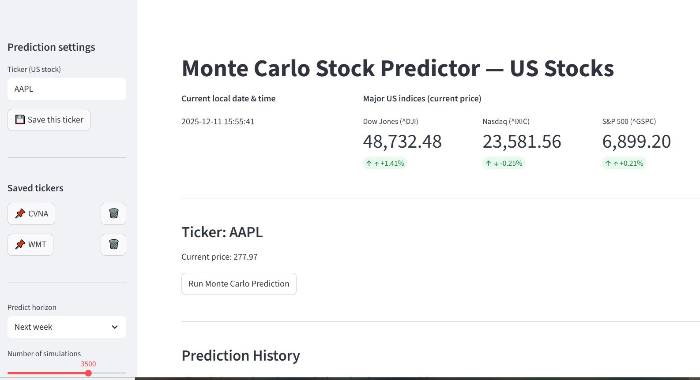
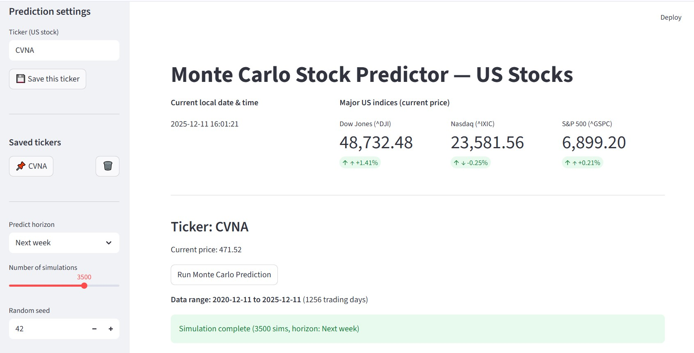
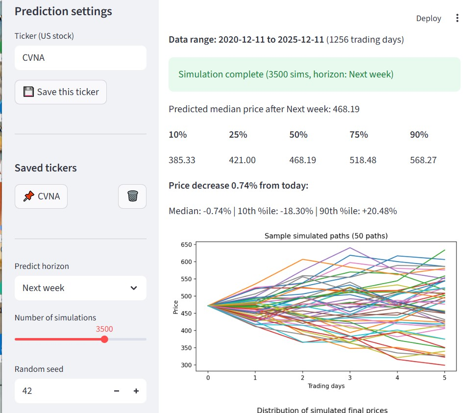
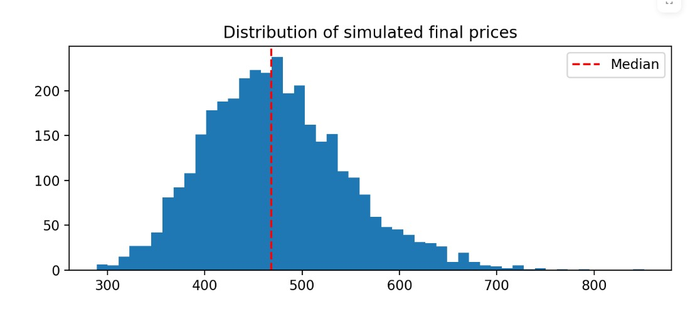
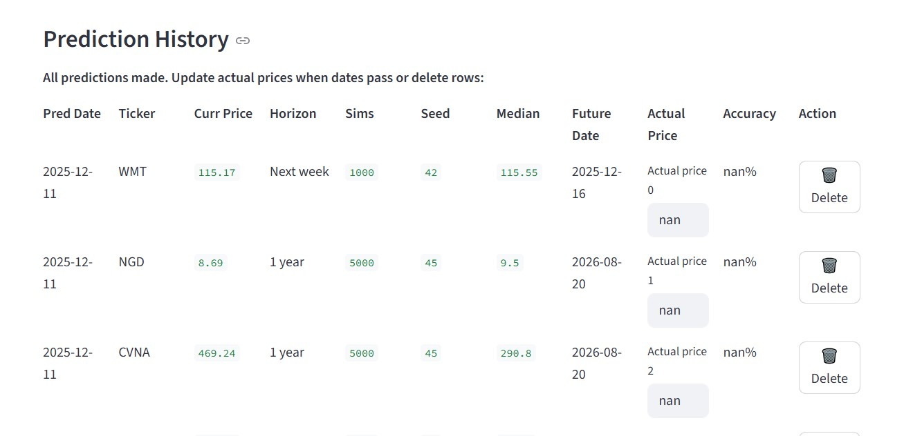

# Monte Carlo Stock Price Predictor

A Streamlit web app that predicts US stock prices using Monte Carlo simulation based on 5 years of historical data from Yahoo Finance.

## 📊 Features

- **Real-time market data**: Display current prices and daily % changes for major US indices (Dow Jones, Nasdaq, S&P 500)
- **Monte Carlo simulation**: Uses 5 years of historical daily log returns to simulate 1,000+ future price paths
- **Multiple time horizons**: Predict price movements for Next week, Month, 3 months, 6 months, or 1 year
- **Percentile analysis**: View 10th, 25th, 50th, 75th, and 90th percentile predictions
- **Saved tickers**: Quick-access buttons for frequently analyzed stocks
- **Prediction history**: Track all past predictions with accuracy metrics
- **Visual analysis**: See simulated price paths and final price distribution

---

## 🚀 Quick Start

### Installation

1. **Create a conda environment** (Python 3.9+):
```bash
conda create -n stock-pred python=3.11 -y
conda activate stock-pred
```

2. **Install dependencies**:
```bash
pip install -r requirements.txt
```

3. **Run the app**:
```bash
streamlit run streamlit_app.py
```

4. **Open browser**: Visit `http://localhost:8501`

---

## 📸 Screenshots & Features

### 1. Main Dashboard Header


**Description:**
- **Current local date & time**: Real-time clock showing when prediction was made
- **Market indices display**: Shows Dow Jones, Nasdaq, and S&P 500 with:
  - Current price
  - Daily % change (e.g., +1.02%)
  - Green ↑ arrow for gains, Red ↓ arrow for losses

### 2. Ticker Search & Saved Tickers Sidebar


**Description:**
- **Ticker input**: Enter any US stock ticker (e.g., AAPL, CVNA, WMT)
- **Save button**: Store frequently used tickers for quick access
- **Saved tickers list**: Click 📌 button to instantly load a saved ticker, click 🗑️ to delete
- **Prediction horizon**: Select timeframe (Next week, Month, 3 months, 6 months, 1 year)
- **Number of simulations**: Slider to adjust accuracy vs. speed (100–5000)
- **Random seed**: Control randomness for reproducibility

### 3. Current Stock Price Display


**Description:**
- Displays selected ticker (e.g., "Ticker: CVNA")
- Shows current market price
- "Run Monte Carlo Prediction" button to start simulation

### 4. Simulation Results & Percentiles


**Description:**
- **Success message**: Confirms simulation complete with number of sims and time horizon
- **Predicted median price**: Most likely price after the chosen time period
- **5 percentile columns** (10%, 25%, 50%, 75%, 90%):
  - Shows price at each confidence level
  - Example: 10% = $68.41 (pessimistic), 50% = $290 (median), 90% = $1,155 (optimistic)
- **Price change indicator**: Shows % increase/decrease from today's price
  - "Price increase 38.66% from today:" (or decrease if negative)

### 5. Simulated distibution Paths Chart


**Description:**
- 50 sample price paths plotted over the prediction horizon
- Each line represents one possible future price trajectory
- X-axis: Trading days ahead
- Y-axis: Predicted stock price
- Shows the range of possible outcomes and market volatility

### 6. Price Distribution Histogram


**Description:**
- Bar chart showing distribution of final prices from all 1000+ simulations
- Red dashed line marks the median prediction
- Shows concentration of likely prices and tail risks
- Wider spread = more uncertainty

### 7. Prediction History Table


**Description:**
- Track all past predictions with columns:
  - **Pred Date**: When prediction was made
  - **Ticker**: Stock symbol
  - **Curr Price**: Price when you made the prediction
  - **Horizon**: Time period (week, month, etc.)
  - **Sims**: Number of simulations run
  - **Seed**: Random seed used
  - **Median**: Your predicted price
  - **Future Date**: When the horizon ends
  - **Actual Price**: Input real price after the date passes
  - **Accuracy**: Auto-calculates accuracy % once actual price is entered
  - **Delete button**: Remove old predictions

---

## 🎥 App Demo (GIF)

[**INSERT GIF HERE**]

*Note: To add a GIF, use this format:*
```markdown

```

**GIF should show:**
1. Loading the app
2. Entering a ticker (e.g., CVNA)
3. Running a Monte Carlo prediction
4. Viewing results with percentiles, charts, and history
5. Changing random seed to see different predictions

---

## 📈 How It Works: Monte Carlo Simulation

### Mathematical Foundation

The app uses **Geometric Brownian Motion (GBM)** to simulate stock prices:

$$dS = \mu S \, dt + \sigma S \, dW$$

Where:
- **S** = Stock price
- **μ** = Mean daily return (drift)
- **σ** = Daily volatility (standard deviation of returns)
- **dW** = Random increment

### Process

1. **Extract 5 years of historical data** from Yahoo Finance
2. **Calculate daily log returns**: $r_t = \ln(P_t / P_{t-1})$
3. **Estimate parameters**:
   - Mean return: μ = average(r_t)
   - Volatility: σ = std(r_t)
   - Drift: μ - 0.5σ²
4. **Generate N simulations** (default 1000):
   - For each day in the horizon (up to 252 trading days for 1 year):
   - $S_{t+1} = S_t \times e^{(drift + \sigma \times Z)}$
   - Where Z ~ Normal(0,1)
5. **Extract percentiles** from final prices across all paths

### Why This Works

- **Accounts for volatility**: Captures market risk
- **Non-linear growth**: Prices can't go below $0
- **Multiple outcomes**: Shows range of possibilities, not a single prediction
- **Historical basis**: Uses actual 5-year volatility and trend

---

## 📁 File Structure

```
buyorsellstock/
├── streamlit_app.py                # Main Streamlit app
├── requirements.txt                # Python dependencies
├── prediction_history.csv          # Stores past predictions
├── saved_tickers.json              # Stores saved ticker list
├── README.md                       # This file
├── screenshots/                    # (Create this folder and add images)
│   ├── dashboard_header.png
│   ├── sidebar.png
│   ├── stock_info.png
│   ├── percentiles.png
│   ├── price_paths.png
│   ├── distribution.png
│   └── history.png
└── gifs/                           # (Create this folder and add demo GIF)
    └── demo.gif
```

---

## 🎛️ Configuration & Parameters

| Parameter | Range | Default | Explanation |
|-----------|-------|---------|-------------|
| Ticker | Any US stock | AAPL | Stock symbol to predict |
| Predict horizon | 5 options | 1 year | Time period for prediction |
| Number of simulations | 100–5000 | 1000 | More = more accurate but slower |
| Random seed | Any integer | 42 | Controls randomness; same seed = same result |

---

## 📊 Interpreting Results

### Percentile Meaning

- **10th percentile** ($68.41): 90% chance price will be **above** this
- **25th percentile** ($120): 75% chance price will be **above** this
- **50th percentile (Median)** ($290): Most likely price
- **75th percentile** ($450): 75% chance price will be **below** this
- **90th percentile** ($1,155): 90% chance price will be **below** this

### Price Change Interpretation

- **"Price increase 38.66% from today"** → Median predicts gain of 38.66%
- **"Price decrease 15.23% from today"** → Median predicts loss of 15.23%

### Accuracy Metrics

Once actual price is entered:
- **Accuracy % = 100 × (1 - |Actual - Median| / Median)**
- **80%+ accuracy** = Excellent prediction
- **60–80% accuracy** = Good prediction
- **Below 60%** = Model needs improvement

---

## ⚠️ Important Caveats

1. **Historical does not guarantee future**: Past 5-year volatility may not reflect future conditions
2. **Black swan events**: Earnings surprises, mergers, macroeconomic shocks are not predicted
3. **For educational purposes**: Not financial advice; don't use for real trading without additional analysis
4. **Retraining needed**: Update predictions regularly as new data arrives
5. **Randomness varies**: Different random seeds will produce different results (this is normal!)

---

## 🛠️ Troubleshooting

### "Simulation failed: Length of values (1000) does not match length of index (1)"
- **Cause**: Data format issue
- **Solution**: Restart Streamlit (`Ctrl+C` then `streamlit run streamlit_app.py`)

### Ticker not found
- **Cause**: Typo or delisted stock
- **Solution**: Verify ticker on Yahoo Finance or a financial website

### Predictions seem unrealistic
- **Cause**: Volatile stock or insufficient historical data
- **Solution**: Try different stocks or increase number of simulations

---

## 📚 Technologies Used

- **Streamlit**: Interactive web framework
- **yfinance**: Yahoo Finance data
- **NumPy/Pandas**: Data processing
- **Matplotlib**: Visualization
- **CSV/JSON**: Data storage

---

## 📝 License

Educational project. Use for learning purposes only.

---

## 👨‍💻 Author

Created for MSCS Spring/Fall 2024 course project.

---

## 🔗 Helpful Links

- [Streamlit Documentation](https://docs.streamlit.io/)
- [Yahoo Finance API](https://github.com/ranaroussi/yfinance)
- [Monte Carlo Simulation Explainer](https://en.wikipedia.org/wiki/Monte_Carlo_method)
- [Stock Market Basics](https://www.investopedia.com/)


Everyone want to get rich from stock market why not we analyze it buy ourselves without paying other.
